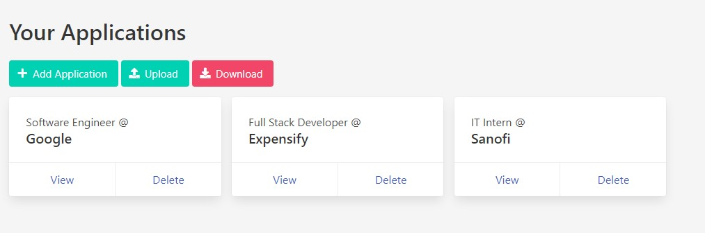

#  V1.1

AppliTrack is a web application that allows you to keep track of your job applications throughout your job search.

## Key Features

- Create a list of your job applications containing information such as the Company Name, Position, Date Applied, etc.
- Download a text file containing your application data, and upload it to merge it with your existing applications for easy cross-computer transfer.

## Todo

- ~~Add view functionality~~
- ~~Add delete functionality~~
- Add edit functionality
- ~~Let users download/upload their data~~
- ~~Add sort functionality~~
- Add filter functionality
- Pretty up home page
- Add reminder for job follow ups 2 weeks after
- Test for invalid file upload
- Prevent download for zero entries
